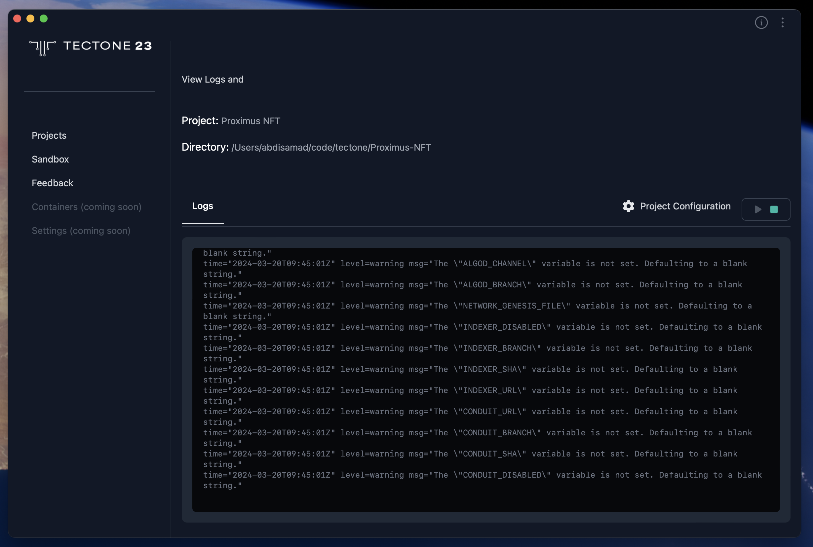

# How To Access Sandbox Logs

- **Project Information**: The interface prominently displays your project's name, making it easy to identify the specific environment you're working with. Additionally, the full directory path is presented, allowing you to locate your project's files and folders within your system.

- **Live Log View**: Gain valuable insights into your project's runtime behavior through the integrated log viewer. This section displays logs streamed directly from the Docker containers that constitute your project's sandbox environment. By monitoring these logs, you can effectively debug issues and track the execution flow of your project.

- **Sandbox Controls**: Directly manage your project's sandbox environment from within the Project Details interface. Convenient buttons allow you to start or stop the sandbox with ease, streamlining your development workflow. Whether you need to initiate the sandbox environment for the first time or temporarily halt execution for debugging purposes, these controls provide the necessary functionality.

This consolidated view empowers you to delve deeper into your project's inner workings, identify potential issues, and efficiently manage its execution cycle, all from a centralized location within Tectone Desktop.
