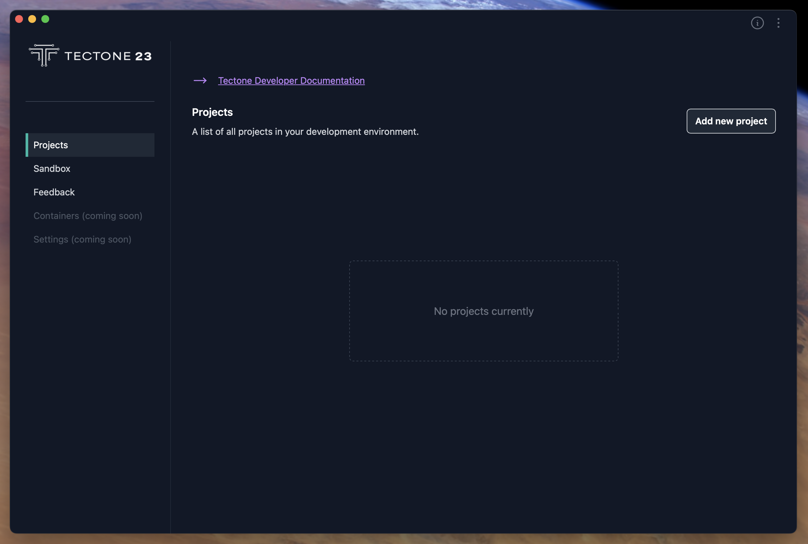
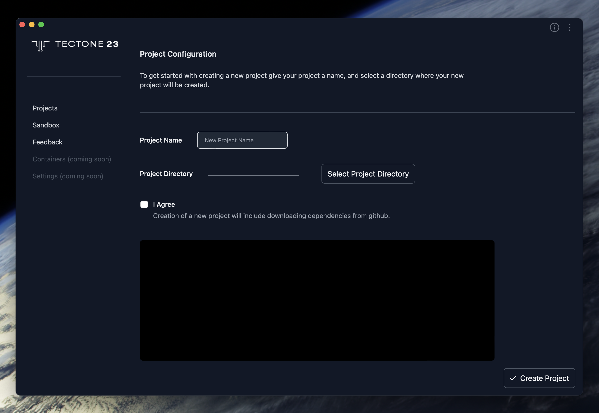
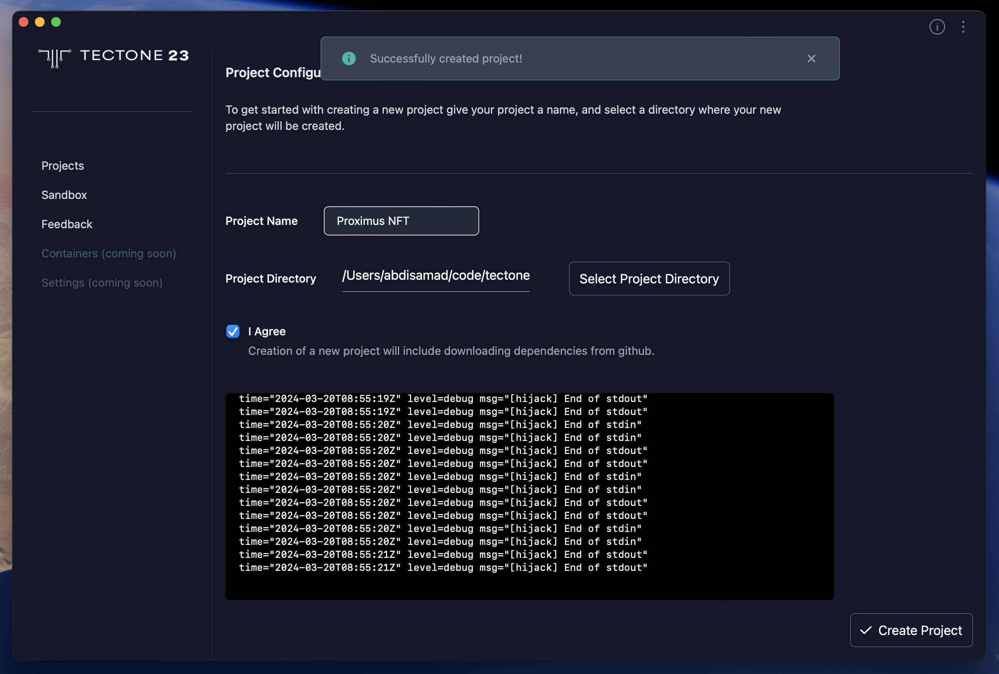
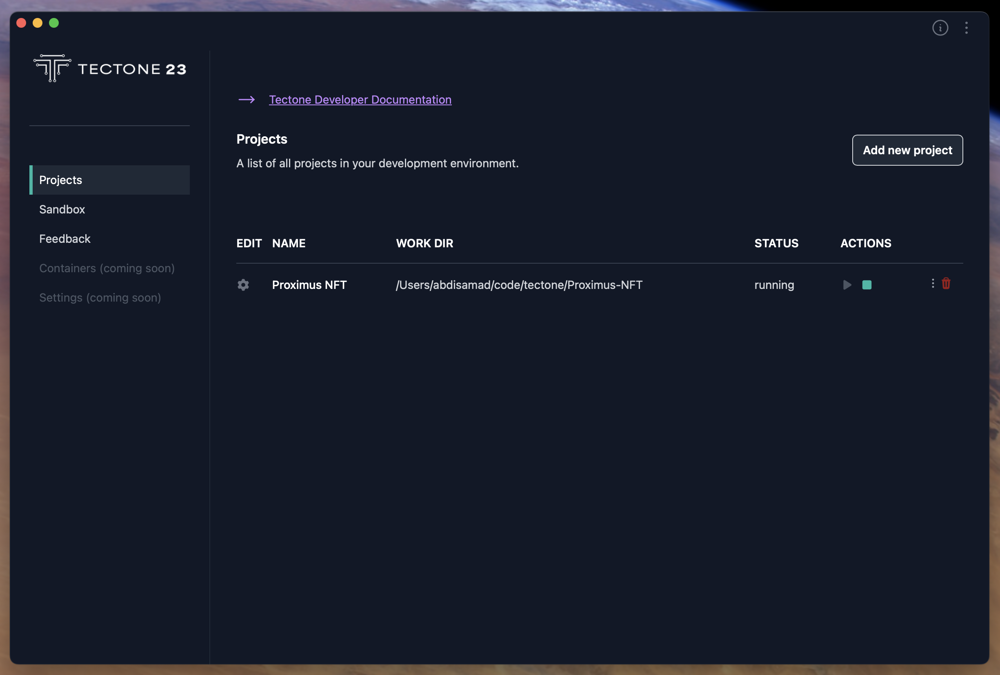
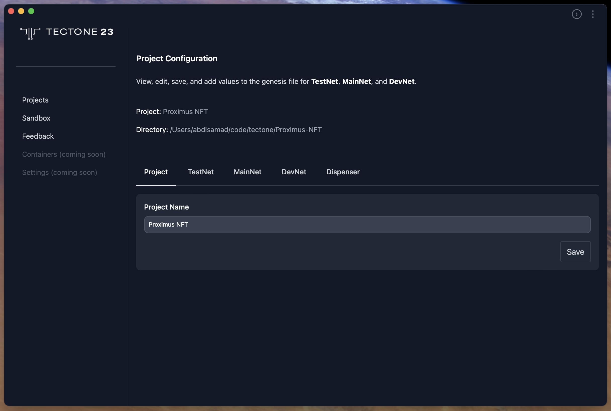

# How To Add A Project

## What is a Project?

In Tectone Desktop, a project represents a development environment specifically designed to work with the T-Core Tectone Blockchain. Each project maintains its own isolated sandbox environment, ensuring no conflicts arise between different projects.

When creating a new project, you'll be prompted to provide a name. Tectone Desktop will automatically generate a corresponding folder using the following conventions:

- All characters will be lowercase.
- Spaces will be replaced with hyphens.

This naming convention promotes consistency and simplifies file path management within your development workspace.

## Adding a Project

Within the Projects screen, you'll find a button dedicated to adding new projects. Clicking this button will launch a dedicated interface for configuring your new development environment.

- Project Name: Provide a descriptive name for your project. This name will be used to generate the corresponding project folder.

- Project Directory: Select the desired location for your project folder.

- Dependency Download:

Tectone Desktop relies on external libraries and tools to function correctly. To ensure your project has everything it needs, a checkbox is displayed labeled: "I Agree"

Selecting this checkbox is mandatory as the necessary dependencies will be automatically downloaded from GitHub during project creation. These dependencies are essential for building your project on the T-Core Tectone Blockchain.

Once you've filled out the project name (and optionally chosen a project directory), make sure the dependency download checkbox is selected. Then, click the button to create your new project.

Your project has been successfully created and added to Tectone Desktop. Head over to the Projects section to see your new project listed and ready for development!

## Projects Listed

The Projects section offers a clear view of your development environments, presented in a user-friendly table format. Each row represents an individual project, providing essential details at your fingertips.

- Name: Easily identify your projects with clear and concise names.
- Work Dir: Locate your project's files and folders with the displayed full path to the working directory.
- Status: Stay informed about your project's sandbox environment with visual indicators for "Running" and "Exited" states.
- Actions: Take control of your development workflow using the dedicated "Actions" column. This column provides buttons to conveniently start or stop the sandbox for your chosen project.

This streamlined layout allows you to efficiently monitor and manage all your projects within Tectone Desktop.

## Project Configuration

Tectone Desktop provides a dedicated interface for configuring your project's details. Here, you can edit the displayed name for your project. This name change is purely for organizational purposes within the Projects section and won't affect the actual project folder name on your system. This allows you to personalize your project listings and maintain a clear overview within Tectone Desktop.
