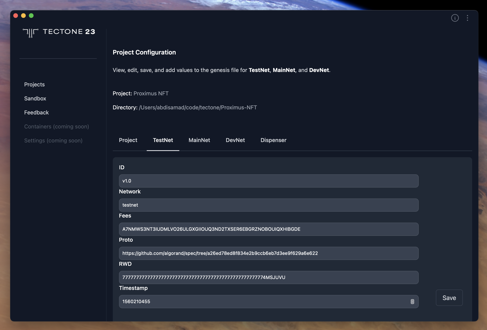
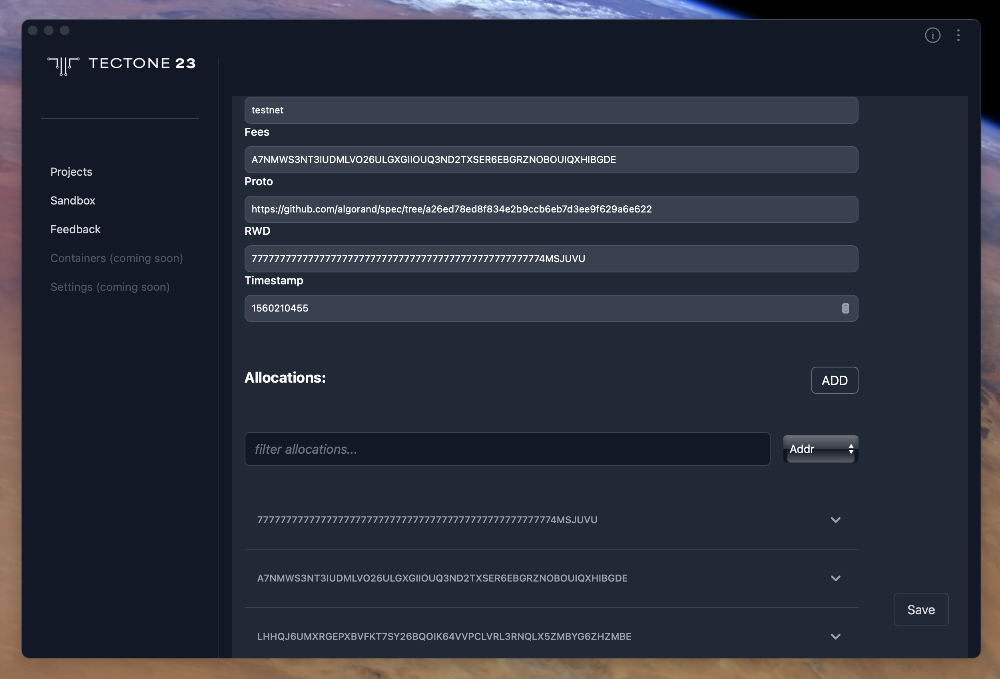
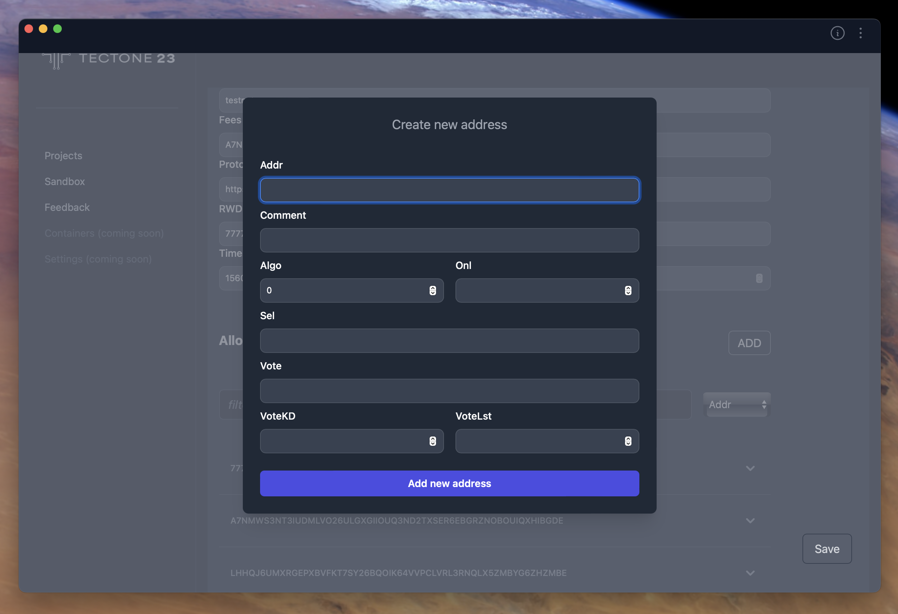
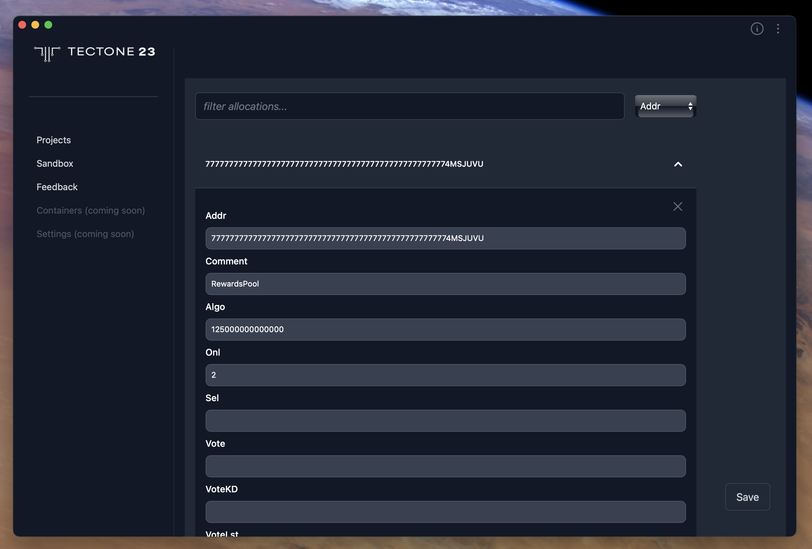
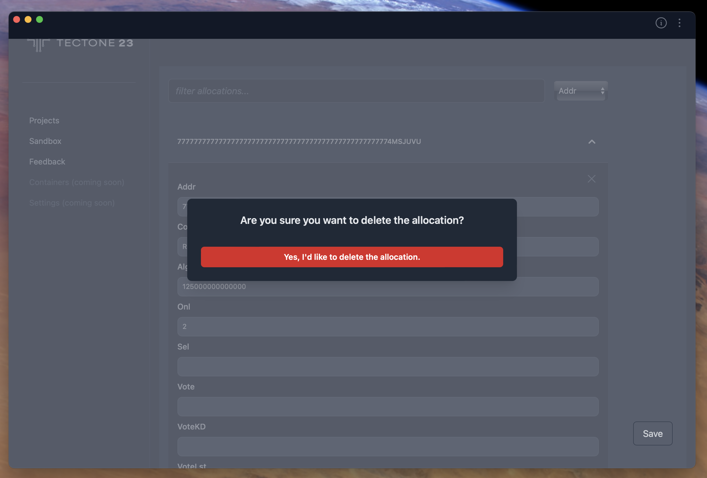

# How To Edit Genesis Configurations

## Networks

### Edit Configuration values

The T-Core Tectone Blockchain utilizes multiple networks for different development and deployment stages. This section of the application allows you to configure your development environment to interact with the desired network, be it TestNet, MainNet, or DevNet. Here you can manage the settings for each network, ensuring your development workflow seamlessly integrates with the appropriate blockchain environment.

The configurations for **TestNet**, **MainNet**, and **DevNet** are similar, so the following guide applies to them all. You can edit the values and save them.

## Allocations

Your network configuration includes a list of allocations, which are wallet addresses on the T-Core Tectone Blockchain. This section allows you to:

- **View Allocations**: See a list of all allocations associated with the current network, including their addresses.

- **Filter Allocations**: Use the search bar to filter the list by selecting a field (e.g., address) and entering a value. This helps you quickly find specific allocations.

- **Add Allocations**: Click the "Add" button above the search bar to create a new allocation and associate it with the current network.

### Add Allocations

#### Adding a New Allocation:

Click the "Add" button to open a modal window where you can create a new allocation for the current network. Simply fill out the required fields and click "Add new address" to save the allocation to the network configuration.

#### Verifying the Allocation:

Once saved, you can use the search bar to filter the allocation list and confirm the new allocation appears.

### Edit Allocations

To modify an existing allocation, locate it within the list and make the desired changes directly in the corresponding fields. Any edits made will be automatically saved upon clicking the "Save" button.

### Delete Allocations

Individual allocations can be removed from the network configuration. To delete an allocation:

1. Locate the allocation you wish to remove in the list.

2. Click the delete icon (X) associated with that allocation. This icon can be seen upon expanding the particular allocation accordion.

3. A confirmation dialog will appear to prevent accidental deletion. Confirm the deletion if intended.

**Important Note**: Deleting an allocation is a permanent action. Once confirmed, the allocation cannot be recovered.
