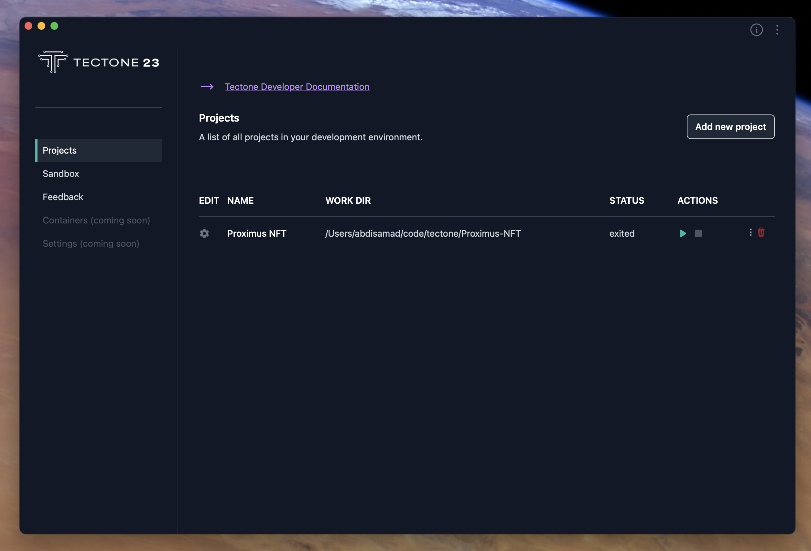

# How To Start and Stop Sandbox Environment

Tectone Desktop gives developers an single place of managing environment including the startup and shutdown of sandbox environment which run on docker container. Under the hood it is managed and run by docker, but with Tectone Desktop you do not have to use the terminal or multiple desktop applications to manage your environment.

Click on the _play_ and _stop_ icons (under **ACTIONS**) to start or stop the sandbox environment.
