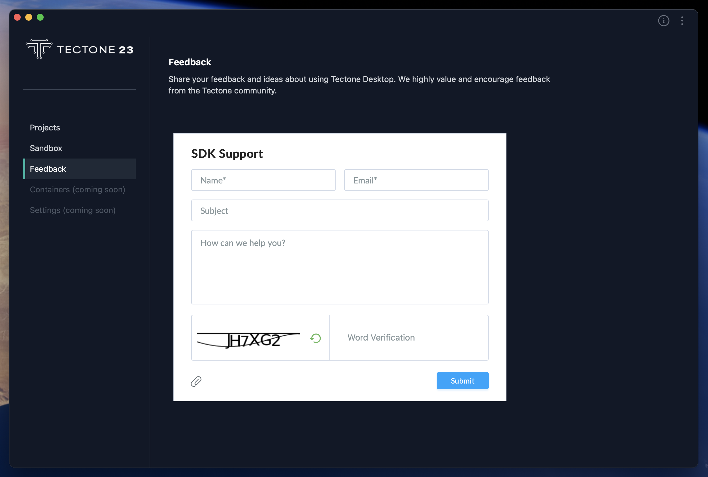

# Bug Reports and Feedback

Tectone Desktop provides a built-in feedback and bug reporting tool to enhance user experience and development. This user-friendly interface allows developers to submit reports directly within the application. Users can provide their name and email for reference, and craft a detailed message describing the issue or feedback. Additionally, the tool offers the option to attach a screenshot for further clarification. This screenshot can capture either the bug itself or the specific area of the application relevant to the feedback. By utilizing this tool, developers can efficiently communicate with Tectone23, ensuring a smooth development workflow.

